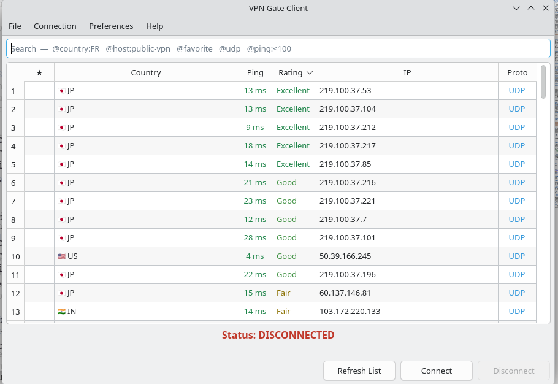
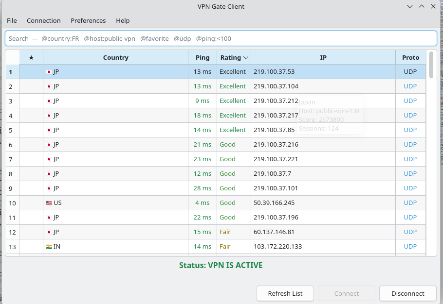
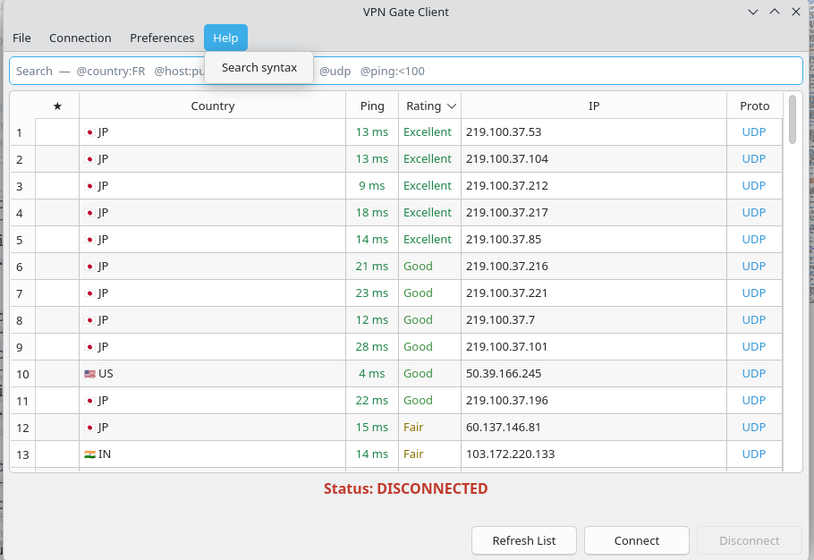
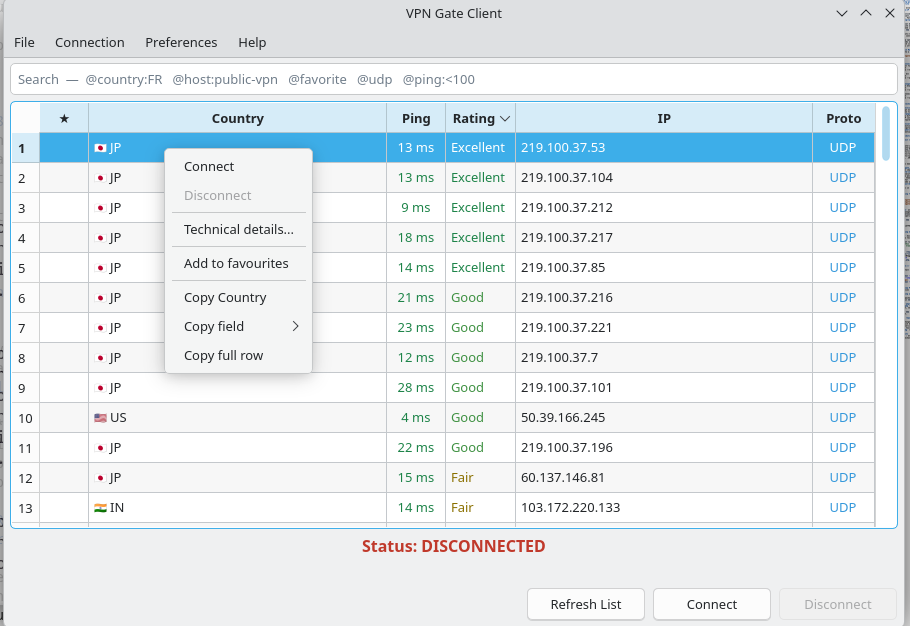
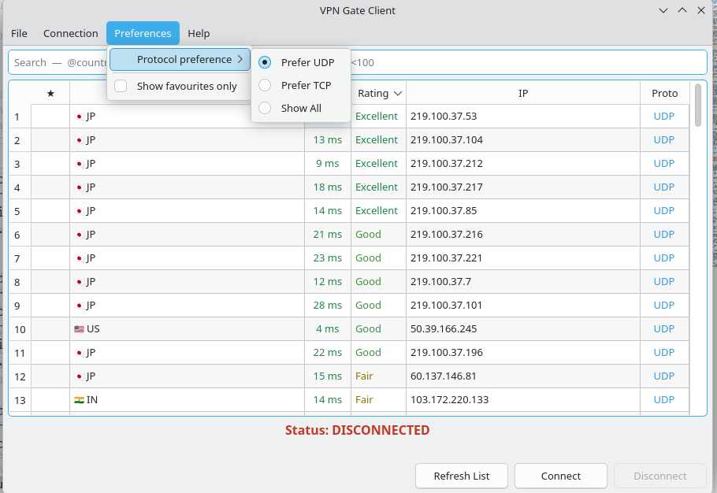
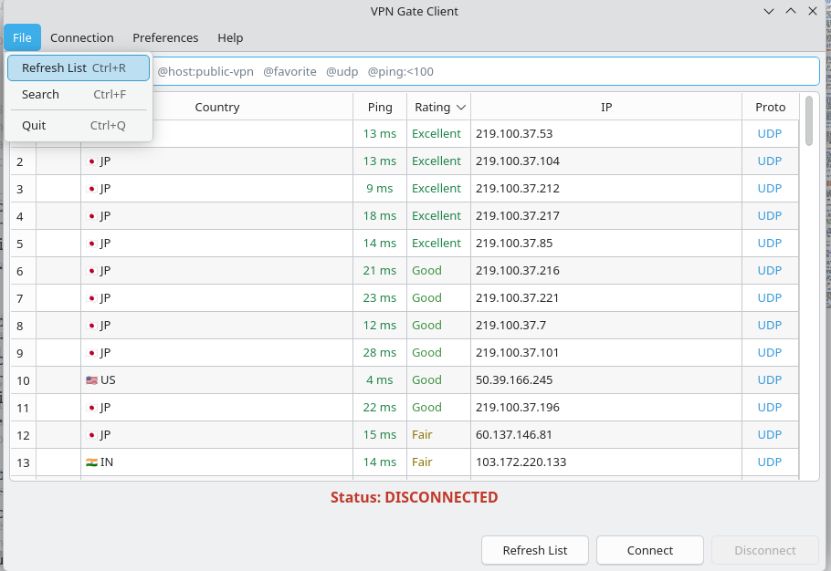
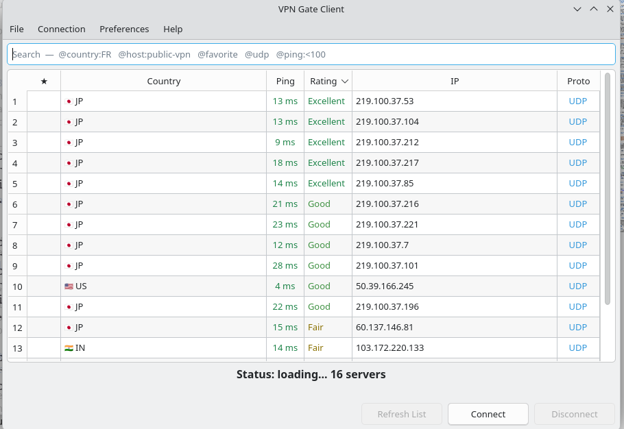

# VPN Gate Client

A lightweight CLI and GUI for connecting to [VPN Gate](https://www.vpngate.net/)
servers through NetworkManager (`nmcli`). Built for modern Linux systems whose
OpenSSL is too strict for the ciphers most VPN Gate servers still use.



**Note:** Tested on CachyOS (Arch) only, fully vibe coded, without an ounce of
networking knowledge, so YMMV. Good luck.

## Features

- **Sortable, searchable server list** with country flags, colour-coded ping and
  rating, and favourites that persist between runs.
- **Protocol preference:** defaults to **UDP** for lower latency and better speed.
- **Legacy support:** automatically configures the older encryption standards
  (`AES-128-CBC`, `SHA1`) that most VPN Gate servers require.
- **10-second connection timeout:** if a server doesn't connect quickly, it's
  skipped rather than left hanging.
- **Easy cleanup:** disconnecting removes the VPN configuration from your system
  entirely — nothing is left cluttering your NetworkManager list.
- **Follows your system Qt theme**, light or dark.

## Installation

### 1. AUR (Arch Linux)

```bash
yay -S vpn-gate-client
```

### 2. Manual

```bash
git clone https://github.com/Me3paw/vpn-gate-client.git
cd vpn-gate-client
```

Install the dependencies yourself. On Arch, use the system packages:

```bash
sudo pacman -S python-requests python-pyqt6 networkmanager networkmanager-openvpn
```

Elsewhere, or if you prefer an isolated environment:

```bash
python -m venv .venv && source .venv/bin/activate
pip install -r src/assets/requirements.txt
```

The scripts do not install anything for you; they print the command to run if a
dependency is missing. `python-requests` is enough for the CLI, the GUI also
needs `python-pyqt6`.

## GUI

```bash
./src/vpngate-gui.py      # from a clone
vpngate-gui               # once installed
```

Pick a server, hit **Connect**. Double-clicking a row connects to it directly.



Closing the window hides it to the tray — **Ctrl+Q** actually quits, tearing the
VPN down on the way out.

### Search

The box above the list takes GitHub-style qualifiers, which combine:

| Qualifier | Matches |
|---|---|
| `@host:public-vpn-78` | host name |
| `@country:FR` | country code or full name |
| `@ip:219.100` | IP address |
| `@proto:udp` | exact protocol |
| `@ping:<100` | ping below a value — also `>50`, or a bare `40` meaning at most 40 |
| `@rating:good` | rating label |
| `@favorite` `@udp` `@tcp` | bare flags |

Sorting is part of the same box:

| Qualifier | Effect |
|---|---|
| `@sort:ping` | sort by a column — `favorite`, `country`, `ping`, `rating`, `ip` or `proto` |
| `@sort-descending` | reverse the direction; on its own it flips the column already in use |

`@sort:score`, `@sort:latency` and `@sort:protocol` are accepted as aliases, and
`@sort-desc` / `@desc` are short forms. Clicking a column header still sorts as
before.

Anything else is free text, matched against country, IP and host name. So
`@country:JP @udp @ping:<50` narrows to fast Japanese UDP servers. The `@` is
optional and everything is case-insensitive.

The same table is available in-app under **Help → Search syntax**:



### Row actions

Right-click any server:



Copy the cell you clicked, any single field, or the whole row as text.
Favourites are marked ★ and persist to
`~/.config/vpn-gate-client/favourites.json`.

### Technical details

The list shows friendly values — `Excellent`, `13 ms` — which hide the numbers
behind them. **Ctrl+I**, the Connection menu, or the row menu opens every field
the API reports, raw value beside the friendly one:


**Copy all** takes the whole table; **Copy OpenVPN config** takes the server's
`.ovpn` file.

### Preferences



Switch to **Prefer TCP** if UDP is blocked on your network. **Show All** lists
every server regardless of protocol.

### Shortcuts



| Shortcut | Action |
|---|---|
| `Ctrl+R` | refresh the list |
| `Ctrl+F` | focus the search box |
| `Ctrl+I` | technical details |
| `Ctrl+K` | connect |
| `Ctrl+D` | disconnect |
| `Ctrl+Q` | quit |

### Startup speed

The API is a single ~1.3 MB response, already gzipped, so the fetch takes a few
seconds and nothing can shrink it. The window doesn't make you wait for it: the
last fetch is cached under `~/.cache/vpn-gate-client/` and shown immediately,
then live rows stream in as they arrive and replace it.



The table stays usable throughout, and quitting during a fetch abandons the
download rather than waiting for it.

## CLI

```bash
./src/vpngate-cli.py      # from a clone
vpngate                   # once installed
```

Prints the top servers by score and prompts for an index.

**Connection options**

```bash
vpngate --tcp     # TCP servers only, if UDP is blocked on your network
vpngate --all     # every server, regardless of protocol
```

**Management**

```bash
vpngate --status  # is the VPN currently active?
vpngate --stop    # disconnect and remove it from NetworkManager
```

## Troubleshooting

### Connection timeouts

The 10-second timeout is deliberate. Many VPN Gate servers are volunteer-hosted
and may be offline or congested. If a connection times out:

1. Try again — a different server each time.
2. Prefer one with a slightly higher ping but a better rating.
3. If UDP consistently fails, switch to TCP (`vpngate --tcp`, or
   **Preferences → Protocol preference → Prefer TCP**).
4. On a slow network, raise the timeout in `src/vpngate_core.py`.

### How connecting works

- **Connection name:** `vpngate-active`
- **Configuration:** `nmcli connection import`, then a manual `vpn.data` edit to
  inject `data-ciphers-fallback` and the legacy providers.
- **Credentials:** username `vpn`, password `vpn` — set automatically, as VPN
  Gate expects.

## Contributing

### Project layout

```
src/vpngate-cli.py              CLI entry point (argparse, server table, prompt)
src/vpngate-gui.py              GUI entry point (PyQt6 window, tray icon, stats)
src/vpngate_core.py             All the logic: fetch, parse, connect, disconnect
src/assets/icons/               Application icons (32/64/128/256 px, plus SVG)
src/assets/requirements.txt     Python dependencies
src/assets/vpngate-gui.desktop  Desktop entry
images/                         README screenshots
PKGBUILD, .SRCINFO              Arch packaging
build-local.sh                  Build the package from your working tree
```

Two rules keep this working:

- **`vpngate_core.py` uses an underscore, the entry points use hyphens.** The
  core is imported, so its name must be a valid Python identifier; a file named
  `vpngate-core.py` cannot be imported by any syntax. The entry points are only
  ever executed, so hyphens are fine there.
- **Entry points and the core must sit in the same directory, with `assets/`
  beside them.** Each script resolves `SCRIPT_DIR` from its own realpath and
  looks for `assets/...` relative to it. That single relative path is why the
  same code works from a clone, from `/usr/share/vpn-gate-client/`, and through
  the `/usr/bin` symlinks. If you move a file, move it in `PKGBUILD` too.

Put logic in `vpngate_core.py`, not in the entry points, so the CLI and GUI stay
in sync.

### GUI architecture

The server list is a `QAbstractTableModel` behind a `QSortFilterProxyModel`.
Two consequences worth knowing before you touch it:

- **Never index the server list with a view row.** Sorting and filtering make
  the two diverge, and the failure is silent — you connect to the wrong server.
  Go through `proxy.mapToSource(index).row()`, as `server_at_view_index` does.
- **Formatting lives in the model's roles.** `DisplayRole` returns the friendly
  string, `UserRole` the typed value used for sorting, `ForegroundRole` the tier
  colour. Colours come from the active palette, so they stay legible in both
  light and dark themes.

### Running from a clone

```bash
./src/vpngate-cli.py --status     # safe, no root, no network
./src/vpngate-cli.py --all        # lists servers, needs network
./src/vpngate-gui.py
```

`--status` and the server listing are harmless. Connecting talks to
NetworkManager and will ask for polkit authentication. `./src/vpngate-cli.py
--stop` always cleans up: it takes the connection down *and* deletes it, so a
failed experiment leaves nothing behind.

To check the GUI starts without a display:

```bash
QT_QPA_PLATFORM=offscreen ./src/vpngate-gui.py
```

PyQt6 turns an exception raised inside a reimplemented virtual (`changeEvent`,
`data`, `filterAcceptsRow`) into a bare `abort()` with **no traceback**. If the
app dies silently, that is almost always why — run it under
`python -X faulthandler` to get the offending line.

### Testing the package

Use the helper:

```bash
./build-local.sh
```

It prints the installed layout and the path to the `.pkg.tar.zst`, then:

```bash
sudo pacman -U vpn-gate-client-*.pkg.tar.zst
vpngate --status
vpngate-gui
sudo pacman -R vpn-gate-client
```

**Why not just run `makepkg`?** Two reasons, both of which bite:

- The committed `PKGBUILD` fetches `#tag=v${pkgver}` from GitHub, so a plain
  `makepkg` builds **whatever that tag holds** — not your working tree. If the
  tag predates a change to the layout, `package()` fails on a path that exists
  perfectly well in your clone:

  ```
  install: cannot stat 'src/vpngate-cli.py': No such file or directory
  ==> ERROR: A failure occurred in package().
  ```

  That is the tag being stale, not the PKGBUILD being wrong.

- **Never run `makepkg` in the repo root.** Its `$srcdir` is `./src`, which is
  where this project's source lives, and `SRCDEST` defaults to the PKGBUILD
  directory — so it drops a bare clone next to your files and a checkout of the
  released tag *inside* `src/`. Both are gitignored, but it is confusing.

`build-local.sh` avoids both: it rewrites `source=` to a `git+file://` URL
pointing at your clone and builds in a scratch directory. `git+file://` clones
**committed** state only, so commit before each run — the script warns if you
have not.

Run `namcap PKGBUILD *.pkg.tar.zst` (from the `namcap` package) to catch missing
dependencies and bad paths.

### Cutting a release

The AUR package installs from the tag named in `source=`, so a release is not
live until the tag exists:

1. Bump `pkgver` in `PKGBUILD`.
2. `makepkg --printsrcinfo > .SRCINFO`
3. Commit, then `git tag vX.Y.Z && git push --tags`.

Skipping the tag leaves `yay -S vpn-gate-client` pointing at a commit that does
not exist.

### Screenshots

Screenshots in `images/` are cropped to the application window. Capture at the
default window size, crop out everything but the window, and keep the file name
describing what it shows.

### Pull requests

- Keep changes to `vpngate_core.py` behaviour-compatible with both front ends.
- Say which distro and desktop environment you tested on. This project has only
  been exercised on Arch with NetworkManager.
- If you touch installed paths, include the `tar tf` output from a local
  `makepkg` run.

## Credits

- VPN Gate: https://www.vpngate.net/en/
- u/fluidmechanicsdoubts on Reddit
